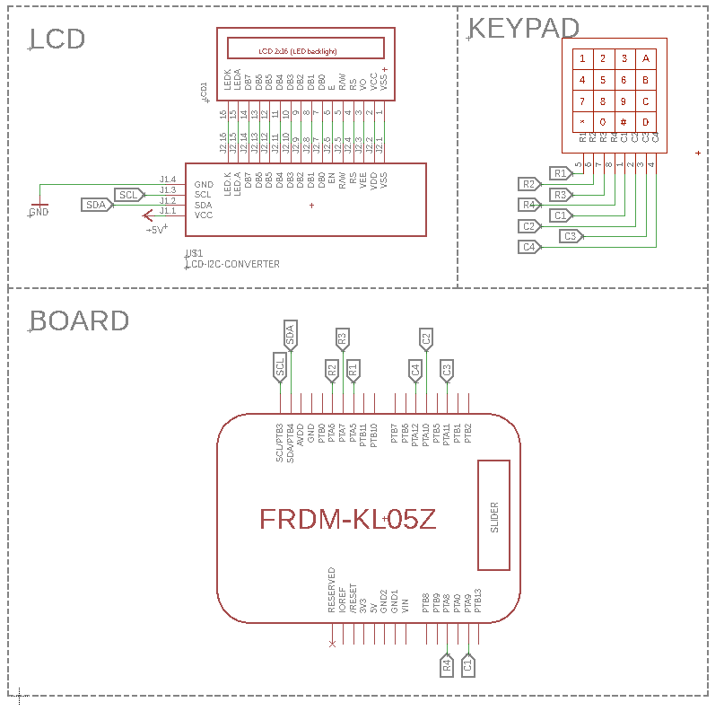

# FRDM-KL05Z Calculator
This is a academic project for the *Microprocessor Programming Techniques* module. The purpose is *"Create a calculator with basic math functions like addition, subtraction, multiplication, division"*. Calculator is build on FRDM-KL05Z NXP development platform based on Arm Cortex-M0+ Core. Development environment is Keil uVision5
## Schematic

A simple schematic is provided below. </br>
Keypad buttons: </br>
```
A = "+"
B = "-"
C = "*"
D = "/"
# = "="
* = "C"
```




