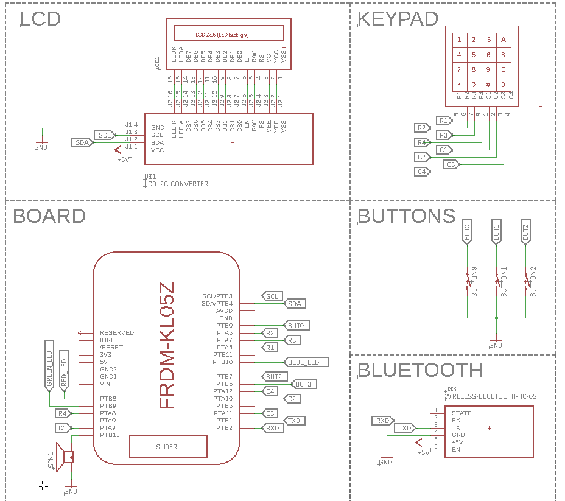

# FRDM-KL05Z Smart Clock

The main objective of the project was to create Smart Clock The project is build on FRDM-KL05Z NXP development platform based on Arm Cortex-M0+ Core. Development environment is Keil uVision5, the code is written in C language. The DMA is used as a bus master, it can read ADC measurements and write variable to memory. The usart is implemented using circular buffer. It uses dynamic memory allocation, so there is a need to increase heap size in [startup_MKL05Z4.s](RTE/Device/MKL05Z32xxx4/startup_MKL05Z4.s)
```
Heap_Size EQU 0x00000100
```
The calculator operates on floating point numbers, so increment stack size in the same file.
```
Stack_Size EQU 0x00000300
```
## Modes
The clock has three different main modes. In each mode user can set the current time and alarm time using the hardware real-time clock (RTC). Each of the modes is signaled by the RGB diode located on the board. To change mode press BUT1.
- Red LED - Calculator mode
- Green LED - Temperature mode
- Blue LED - Display message mode
### Time settings
To set time press BUT2. The cursor should blink on LCD. By clicking BUT3 you can change actual value. Press BUT2 to go next. If the RTC time is set, the next step is to set the  RTC alarm. Configuration is the same as for RTC time. Setting the alarm is signaled by sending a message via UART.
### First mode - CALCULATOR
The Calculator is implemented basic math functions like addition, subtraction, multiplication, division. It uses additional 4x4 membrane keypad.
</br>Features:
- send mathematical operation via UART
- display floating point number if needed
- work with more than one sign other than "=" e.g input: 5/10+6-3 output 3.50

A simple schematic is provided below. </br>
Keypad buttons: </br>
```
A = "+"
B = "-"
C = "*"
D = "/"
# = "="
* = "C"
```




